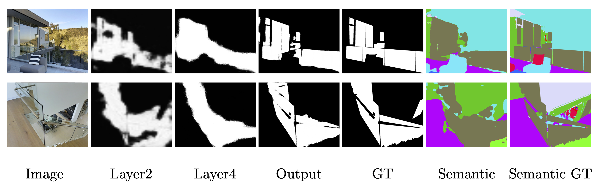
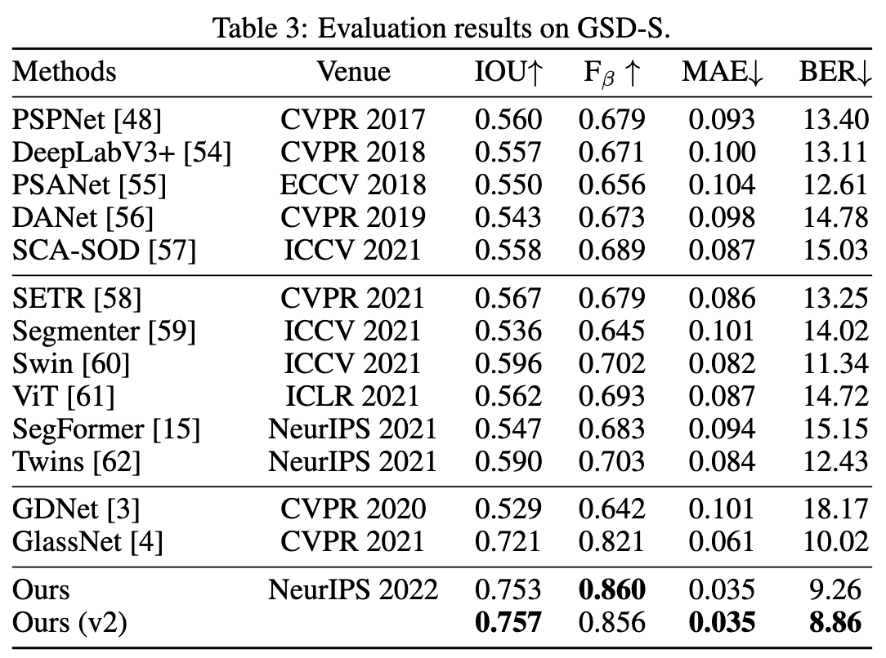

# 'Exploiting Semantic Relations for Glass Surface Detection' (NeurIPS 2022)

<!-- > [<a href="_readme_doc/CVPR1159_Mirror_detection_supplementary_material_2022.pdf">Project Page</a>]  -->
> [<a href="https://jiaying.link/neurips2022-gsds/">Project Page</a>] [<a href="">Paper</a>] [<a href="assets/poster.pdf">Poster</a>] 

This is an update on GlassSemNet from which the model is now able to produce semantic segmentation predictions for visualization purpose.

## Visualization

Segmentations produced by the semantic backbone illustrated that the model was able to recognize object semantics. Features (layers 2 and 4) from intermediate layers were extracted and fed to auxiliary classifiers. 



## Comparison



Some minor improvements were obtained after changing the semantic backbone from ResNet50 to ResNext50_32x4d.

## Demo

Inference and visualization scripts with respective required input directories. <a href="https://drive.google.com/file/d/1VpN9sojp8nBETVdaPHyyOssJsXrOshV3/view?usp=sharing">Trained model weights (v2)</a> available for inference and testing. 

```bash
# To view the segmentation results, pass the 'SEMANTIC' flag argument into the scripts

> python predict.py -c CHECKPOINT -i IMAGE -o OUTPUT [-s SEMANTIC]

> python visualize.py -i IMAGE -p PREDICTION -o OUTPUT [-s SEMANTIC] 
```

Evaluation script for performance assessment. <a href="https://drive.google.com/file/d/1KmbCN1-CDN3ITsrgEXyZ0RHd509uiqlR/view?usp=sharing">Results by GlassSemNetv2</a> available for reference.

```bash
> python evaluation.py -p PREDICTION -gt GROUNDTRUTH
```

## Citation

```raw
@article{neurips2022:gsds2022,
  author    = {Lin, Jiaying and Yeung, Yuen-Hei and Lau, Rynson W.H.},
  title     = {Exploiting Semantic Relations for Glass Surface Detection},
  journal   = {NeurIPS},
  year      = {2022},
}
```