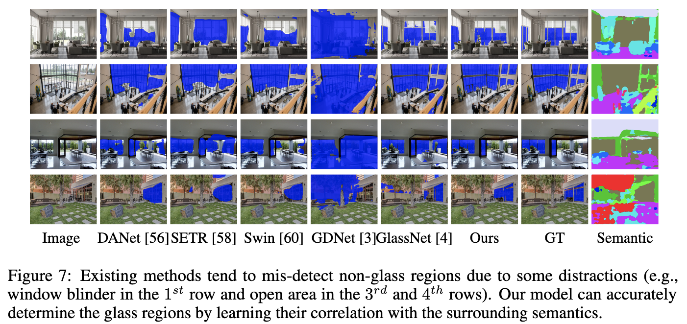

# 'Exploiting Semantic Relations for Glass Surface Detection' (NeurIPS 2022)

<!-- > [<a href="_readme_doc/CVPR1159_Mirror_detection_supplementary_material_2022.pdf">Project Page</a>]  -->
> [<a href="https://jiaying.link/neurips2022-gsds/">Project Page</a>] [<a href="https://openreview.net/forum?id=kBNhgqXatI">Paper</a>] [<a href="assets/poster.pdf">Poster</a>] 

This repository is for the newly proposed dataset *'Glass
Surface Detection - Semantics'* (*'GSD-S'*) along with our detection method *'Glass Semantic Network'* (*‘GlassSemNet’*).

## Dataset Summary


Refer to <a href="utils/GSD-S_color_map.csv">utils/GSD-S_color_map.csv</a> for semantic category color mapping.

## Method Design


## Comparison




## Installation

Library dependencies require python 3.8+ environment and are summarized in <a href="requirements.txt">requirements.txt</a>.

```bash
> pip install -r requirements.txt
```

## Demo

Inference and visualization scripts with respective required input directories. <a href="https://drive.google.com/file/d/1j2yCn434whBFcZLOTxeH0iSGx2uMtV2F/view?usp=sharing">Trained model weights</a> available for inference and testing.

```bash
> python predict.py -c CHECKPOINT -i IMAGE -o OUTPUT

> python visualize.py -i IMAGE -p PREDICTION -o OUTPUT
```

Evaluation script for performance assessment. <a href="https://drive.google.com/file/d/1QyFeH6Md2EYgeb2mAXj4ujUSzSH31O5V/view?usp=sharing">Results by GlassSemNet</a> available for reference.

```bash
> python evaluation.py -p PREDICTION -gt GROUNDTRUTH
```

## Citation

```raw
@article{neurips2022:gsds2022,
  author    = {Lin, Jiaying and Yeung, Yuen-Hei and Lau, Rynson W.H.},
  title     = {Exploiting Semantic Relations for Glass Surface Detection},
  journal   = {NeurIPS},
  year      = {2022},
}
```